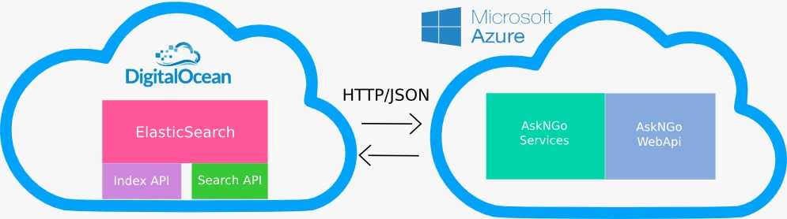
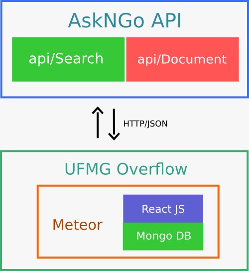

# Team Turing - Ask N Go

## Proposta

Nossa idéia é resolver o problema de atraso no tempo de respostas nos fóruns de dúvidas do Moodle. Com uma API inteligente, que entende a resposta do usuário e sugere - com base em técnicas de recuperação de informação e aprendizado de máquina - discussões que já aconteceram anteriormente, a partir do banco de dados histórico da disciplina.

## Projeto

O projeto foi desenvolvido durante a Hackathon DCC 40 Anos, pelos alunos Allan Sene, Carlos Ferreira, Gabriel Capanema, Gabriel Cardoso e Wagner Teixeira. A apresentação do projeto se encontra [neste link](https://www.canva.com/design/DAB9VLDvzeg/Njm_8Nlok8jv1h1kw6rtrA/view?utm_content=DAB9VLDvzeg&utm_campaign=designshare&utm_medium=link&utm_source=sharebutton)

## Arquitetura

